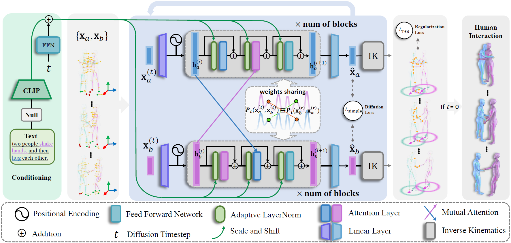

# InterGen

This repository contains the official implementation for the paper: [InterGen: Diffusion-based Multi-human Motion Generation
under Complex Interactions](https://tr3e.github.io/intergen-page/). Our work is capable of simultaneously generating high-quality interactive motions of two people with only text guidance, enabling various downstream tasks including person-to-person generation, inbetweening, trajectory control and so forth. 

<p float="left">
  
</p>


## Getting started

This code was tested on `Ubuntu 20.04.1 LTS` and requires:

* Python 3.8
* conda3 or miniconda3
* CUDA capable GPU (one is enough)

### 1. Setup environment

```shell
conda create --name intergen
conda activate intergen
pip install -r requirements.txt
pip install git+https://github.com/openai/CLIP.git
```

### 2. Get data

<details>
  <summary><b>Text to Motion</b></summary>

Download the data from [InterGen: Diffusion-based Multi-human Motion Generation
under Complex Interactions](https://tr3e.github.io/intergen-page/). And put them to ./data/.

#### Data Structure
```sh
<DATA-DIR>
./annots                //Natural language annotations where each file consisting of three sentences.
./motions               //Raw motion data standardized as SMPL which is similiar to AMASS
./motions_processed     //Processed motion data with joint positions and rotations (6D representation) of SMPL 22 joints kinematic structure.
./split                 //train-val-test split.
```

### 3. Run inference

Modify config files ./configs/model.yaml and ./configs/infer.yaml and input files ./prompts.txt, and then run:

```shell
python tools/infer.py
```
The results will be rendered and put in ./results/

### 4. Train

Modify config files ./configs/model.yaml ./configs/datasets.yaml and ./configs/train.yaml, and then run:

```shell
python tools/train.py
```


### 5. Evaluation

Modify config files ./configs/model.yaml and ./configs/datasets.yaml, and then run:

```shell
python tools/eval.py
```

#### Trajectory control -->

## Applications

<p float="left">
  
</p>
<!--  -->

<!-- #### Person-to-person generation


#### Inbetweening
 -->

## InterHuman Dataset
<!--  -->

InterHuman is a comprehensive, large-scale 3D human interactive motion dataset encompassing a diverse range of 3D motions of two interactive people, each accompanied by natural language annotations.

<p float="left">
  
</p>


It is made available under [Creative Commons BY-NC-SA 4.0](https://creativecommons.org/licenses/by-nc-sa/4.0/legalcode) license. Due to privacy concerns of performers included in our dataset, we cannot share it publicly. You can request the dataset by [filling in this form](https://forms.gle/CjMrUxwdz6iPcTxf7) for the google drive link for **non-commercial purposes**, as long as you give appropriate credit by **citing our paper** and **indicating any changes** that you've made. The redistribution of the dataset is **prohibited**. 


## Code comming soon!


## Licenses
<a rel="license" href="http://creativecommons.org/licenses/by-nc-sa/4.0/"></a><br />This work is licensed under a <a rel="license" href="http://creativecommons.org/licenses/by-nc-sa/4.0/">Creative Commons Attribution-NonCommercial-ShareAlike 4.0 International License</a>.


