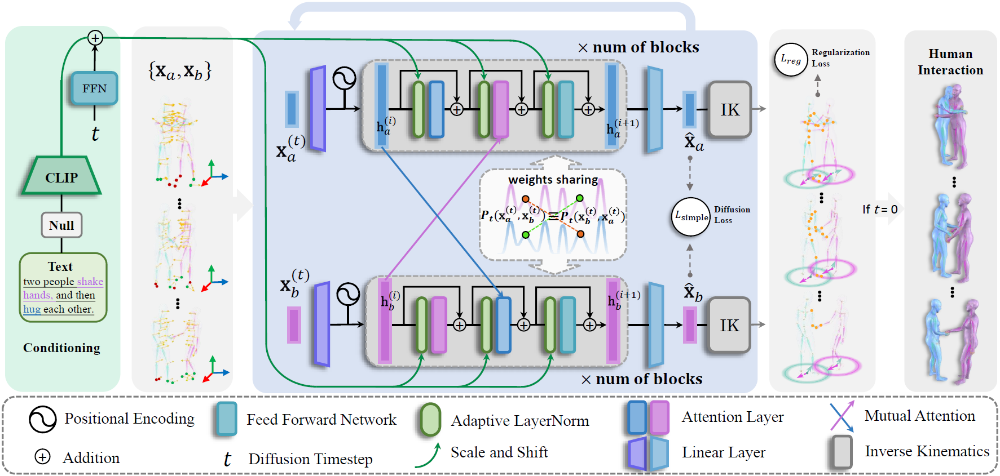

# InterGen

This repository contains the official implementation for the paper: [InterGen: Diffusion-based Multi-human Motion Generation
under Complex Interactions](https://arxiv.org/pdf/2304.05684). Our work is capable of simultaneously generating high-quality interactive motions of two people with only text guidance, enabling various downstream tasks including person-to-person generation, inbetweening, trajectory control and so forth. 

  

<!--  -->

### Code comming soon!

<!-- ### Abstract

We have recently seen tremendous progress in diffusion advances for generating realistic human motions. Yet, they largely disregard the rich multi-human interactions. 
In this paper, we present InterGen, an effective diffusion-based approach that incorporates human-to-human interactions into the motion diffusion process, which enables layman users to customize high-quality two-person interaction motions, with only text guidance.
We first contribute a multimodal dataset, named InterHuman. It consists of about 107M frames for diverse two-person interactions, with accurate skeletal motions and 16,756 natural language descriptions.
For the algorithm side, we carefully tailor the motion diffusion model to our two-person interaction setting. 
To handle the symmetry of human identities during interactions, we propose two cooperative transformer-based denoisers that explicitly share weights, with a mutual attention mechanism to further connect the two denoising processes.
Then, we propose a novel representation for motion input in our interaction diffusion model, which explicitly formulates the global relations between the two performers in the world frame.
We further introduce two novel regularization terms to encode spatial relations, equipped with a corresponding damping scheme during the training of our interaction diffusion model. 
Extensive experiments validate the effectiveness and generalizability of InterGen. Notably, it can generate more diverse and compelling two-person motions than previous methods and enables various downstream applications for human interactions. -->

<!-- ### Methods -->

<!-- ### Text-to-Interaction

#### Trajectory control -->

### Applications

<!-- #### Person-to-person generation

#### Inbetweening
 -->

### InterHuman Dataset

InterHuman is a comprehensive, large-scale 3D human interactive motion dataset encompassing a diverse range of 3D motions of two interactive people, each accompanied by natural language annotations.

It is made available under [Creative Commons BY-NC-SA 4.0](https://creativecommons.org/licenses/by-nc-sa/4.0/legalcode) license. Due to privacy concerns of performers included in our dataset, we cannot share it publicly. You can request the dataset by emailing the first author or corresponding author for the google drive link for **non-commercial purposes**, as long as you give appropriate credit by **citing our paper** and **indicating any changes** that you've made. The redistribution of the dataset is **prohibited**. Your generous star ⭐ means a lot to us if you find our work useful.

### Licenses
 This work is licensed under a <a rel="license" href="http://creativecommons.org/licenses/by-nc-sa/4.0/">Creative Commons Attribution-NonCommercial-ShareAlike 4.0 International License</a>.

